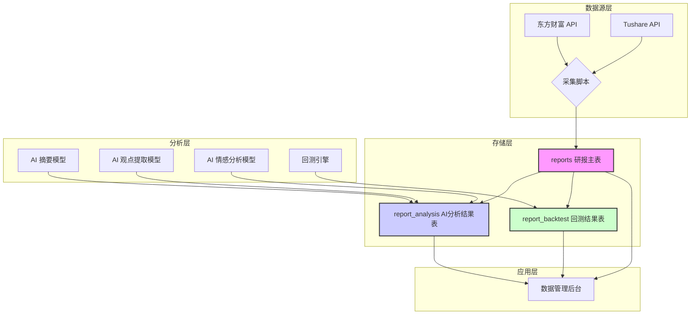

# 研报数据全周期管理架构方案 v1.0

- **版本**: 1.0
- **作者**: Manus AI
- **日期**: 2026-03-02
- **关联需求**: REQ-070 (研究报告采集), REQ-073 (研报 AI 分析与回测)

---

## 1. 核心设计目标

为解决研报数据采集、存储、AI 分析和回测的全周期管理问题，本次架构设计的核心目标是：

1.  **统一存储**：将**个股研报**、**行业研报**、**宏观策略研报**统一存储，并能清晰区分。
2.  **AI 分析解耦**：将 AI 对研报的分析结果（如摘要、观点、情感）与原始研报数据分离，支持多种 AI 模型并行分析，互不干扰。
3.  **回测验证闭环**：将 AI 分析结果与后续市场行情关联，形成可量化的回测指标，验证 AI 分析的有效性。
4.  **高扩展性**：数据模型需具备良好的扩展性，未来可方便地增加新的数据源、AI 分析维度和回测策略。

---

## 2. 总体架构

研报数据的全周期管理分为四层：**数据源层**、**存储层**、**分析层**、**应用层**。



- **数据源层**：以东方财富 API 为主（无限制、数据量大），Tushare API 为辅（补充摘要）。
- **存储层**：核心是三张表，`reports` (研报主表)、`report_analysis` (AI 分析结果)、`report_backtest` (回测结果)。
- **分析层**：包含各类 AI 模型和回测引擎，它们的产出写入存储层对应的表中。
- **应用层**：通过数据管理后台或其他应用，消费和展示各层数据。

---

## 3. 数据模型设计

### 3.1. `reports` 研报主表

这张表将取代现有的 `research_report` 表，统一存储所有类型的研报元数据。

| 字段名 | 类型 | 主键 | 约束 | 说明 |
| :--- | :--- | :--- | :--- | :--- |
| `report_id` | `TEXT` | PK | NOT NULL | 唯一ID，格式 `src-infocode`，如 `eastmoney-AP20260302...` |
| `source` | `TEXT` | | NOT NULL | 数据来源，如 `eastmoney`, `tushare` |
| `report_type` | `TEXT` | | NOT NULL | 研报类型: `stock`, `industry`, `macro`, `strategy` |
| `publish_date` | `DATE` | | NOT NULL | 发布日期 |
| `title` | `TEXT` | | NOT NULL | 研报标题 |
| `abstract` | `TEXT` | | | 研报摘要（主要由 Tushare 填充） |
| `ts_code` | `TEXT` | | | 股票代码（个股研报专属） |
| `stock_name` | `TEXT` | | | 股票简称（个股研报专属） |
| `industry_name` | `TEXT` | | | 行业名称（行业研报专属） |
| `org_name` | `TEXT` | | | 券商机构名称 |
| `author` | `TEXT` | | | 作者 |
| `rating` | `TEXT` | | | 评级，如 `买入`, `增持` |
| `target_price` | `NUMERIC` | | | 目标价 |
| `pdf_url` | `TEXT` | | | PDF 下载链接 |
| `page_count` | `INTEGER` | | | PDF 页数 |
| `collected_at` | `TIMESTAMPTZ` | | DEFAULT now() | 采集时间戳 |

**设计说明**：
- **统一主键 `report_id`**：解决了多源 ID 冲突问题，`source` 字段明确来源。
- **明确类型 `report_type`**：通过该字段区分个股、行业、宏观研报，解决了共存问题。
- **字段兼容**：个股、行业研报的专属字段（如 `ts_code`, `industry_name`）允许为 NULL，保证了模型的统一性。

### 3.2. `report_analysis` AI 分析结果表

这张表用于存储不同 AI 模型对研报的分析结果，与原始研报解耦。

| 字段名 | 类型 | 主键 | 约束 | 说明 |
| :--- | :--- | :--- | :--- | :--- |
| `analysis_id` | `TEXT` | PK | NOT NULL | 唯一ID，格式 `report_id-model_name-model_version` |
| `report_id` | `TEXT` | FK | NOT NULL | 外键，关联 `reports.report_id` |
| `model_name` | `TEXT` | | NOT NULL | AI 模型名称，如 `summary_v1`, `sentiment_v2` |
| `model_version` | `TEXT` | | NOT NULL | AI 模型版本号，如 `1.0.0` |
| `analysis_result` | `JSONB` | | | AI 分析结果，JSON 格式，可灵活扩展 |
| `created_at` | `TIMESTAMPTZ` | | DEFAULT now() | 分析时间戳 |

**设计说明**：
- **复合主键思想**：`analysis_id` 保证了“同一篇研报、同一个模型、同一个版本”只能有一条分析结果，便于版本管理和回溯。
- **JSONB 结果字段**：`analysis_result` 使用 JSONB 类型，可以存储任意结构的分析结果，例如：
  ```json
  // 摘要模型结果
  {"summary": "公司业绩超预期，AI 业务是亮点..."}
  
  // 观点提取模型结果
  {"viewpoints": ["上调目标价至100元", "看好其长期发展"]}
  
  // 情感分析模型结果
  {"sentiment": "positive", "score": 0.92}
  ```

### 3.3. `report_backtest` 回测结果表

这张表用于存储基于 AI 分析结果的回测数据。

| 字段名 | 类型 | 主键 | 约束 | 说明 |
| :--- | :--- | :--- | :--- | :--- |
| `backtest_id` | `TEXT` | PK | NOT NULL | 唯一ID，格式 `analysis_id-strategy_name` |
| `analysis_id` | `TEXT` | FK | NOT NULL | 外键，关联 `report_analysis.analysis_id` |
| `strategy_name` | `TEXT` | | NOT NULL | 回测策略名称，如 `rating_buy_hold_30d` |
| `start_date` | `DATE` | | NOT NULL | 回测开始日期（通常是研报发布日） |
| `end_date` | `DATE` | | NOT NULL | 回测结束日期 |
| `return_rate` | `NUMERIC` | | | 区间回报率 |
| `benchmark_return` | `NUMERIC` | | | 基准回报率（如沪深300同期回报） |
| `alpha` | `NUMERIC` | | | 超额收益 Alpha |
| `sharpe_ratio` | `NUMERIC` | | | 夏普比率 |
| `max_drawdown` | `NUMERIC` | | | 最大回撤 |
| `backtest_log` | `JSONB` | | | 回测详细日志（可选） |
| `created_at` | `TIMESTAMPTZ` | | DEFAULT now() | 回测时间戳 |

**设计说明**：
- **关联分析结果**：通过 `analysis_id` 与 AI 分析结果强关联，明确回测的输入源。
- **策略分离**：`strategy_name` 字段使得可以对同一个 AI 分析结果应用多种不同的回测策略。
- **核心回测指标**：包含了回报率、Alpha、夏普、最大回撤等标准回测指标，便于量化评估。

---

## 4. 实施步骤

1.  **数据库迁移**：
    -   创建 `reports`, `report_analysis`, `report_backtest` 三张新表。
    -   将现有 `research_report` 表的数据（如果未来有）迁移至 `reports` 表。
    -   删除旧的 `research_report` 表。
2.  **采集脚本开发**：
    -   开发东方财富研报采集脚本，数据写入 `reports` 表。
    -   改造现有 Tushare 研报采集脚本，使其作为补充，仅用于更新 `reports` 表的 `abstract` 字段。
3.  **AI 分析模块开发**：
    -   开发第一个 AI 分析模型（如摘要模型），读取 `reports` 表，将结果写入 `report_analysis` 表。
4.  **回测引擎开发**：
    -   开发回测引擎，读取 `report_analysis` 表和行情数据，将结果写入 `report_backtest` 表。
5.  **前端页面更新**：
    -   更新数据管理后台，以适配新的 `reports` 表结构。
    -   开发新的页面，用于展示 AI 分析结果和回测绩效。

这个方案可以清晰地管理研报数据的整个生命周期，并为后续的 AI 功能迭代打下坚实的基础。
